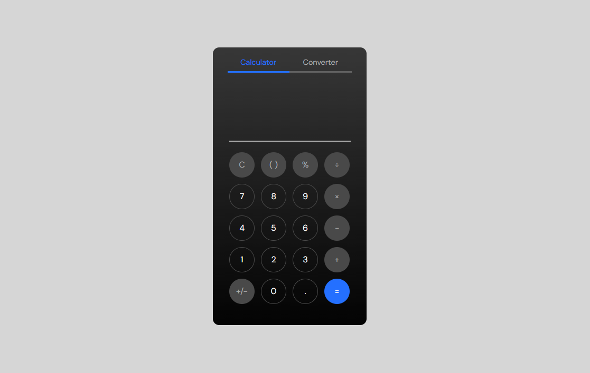

# CalcJS 🧮

A clean, minimal calculator built with vanilla HTML, CSS and JavaScript — no frameworks, no libraries, just pure code.



## ✨ Features

- Basic arithmetic operations: addition, subtraction, multiplication and division
- Percentage calculation
- Positive/negative toggle (`+/-`)
- Decimal point support
- Real-time expression display
- Clear button (`C`) to reset the display
- Dark mode UI
- Responsive layout

## 🚀 Live Demo

[View live demo →](https://calc-js-self.vercel.app/)

## 🛠️ Built With

- HTML5
- CSS3 (CSS Variables, Grid, Flexbox)
- JavaScript (Vanilla)

## 📁 Project Structure

```
CalcJS/
├── assets/
│   └── preview.png
├── index.html
├── style.css
├── script.js
└── README.md
```

## 🏃 Running Locally

No build steps required. Just clone the repo and open `index.html` in your browser:

```bash
git clone https://github.com/ed-matheus/calcjs.git
cd calcjs
open index.html
```

## 🗺️ Roadmap

- [ ] Keyboard support
- [ ] `( )` parentheses support
- [ ] Grand Total (GT) accumulator
- [ ] Converter tab (currency, units, temperature)

## 📄 License

This project is open source and available under the [MIT License](LICENSE).

---

Developed with 💙 by [Edson Matheus](https://www.linkedin.com/in/edson-matheus-b5a0171ba/)